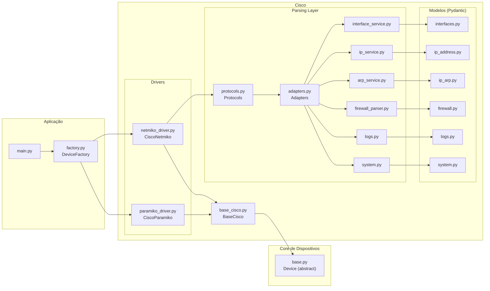

## IGBOTlib documentation


## Project structure

```
devices
    ├───accedian
    ├───cisco
    ├───datacom
    ├───juniper
        ├───drivers
        │   ├───netmiko_driver.py        - Netmiko driver only to access the device
        │   └───paramiko_driver.py       - Paramiko driver only to access the device
        ├───models
        │   ├───arp.py                   - ARP model to store the ARP table as objects
        │   ├───interface.py             - Interface model to store the interfaces as objects
        │   ├───ip_address.py            - IP Address model to store the IP addresses as objects
        │   └───user.py                  - User model to store the users as objects
        └───parsers
            ├───adapters.py              - Adapters to parse the output of the device
            ├───protocols.py             - Protocols to parse the output of the device
            ├───templates
            │   ├───cisco_ios_show_version.textfsm
            │   └───cisco_ios_show_interfaces.textfsm
            ├───textfsm_normalizer.py    - TextFSM normalizer to normalize the output of the device
            └───arp_parser.py           - ARP parser to parse the ARP table
    └───mikrotik
        ├───drivers
        │   ├───netmiko_driver.py       - Netmiko driver only to access the device
        │   └───paramiko_driver.py      - Paramiko driver only to access the device
        ├───models
        │   ├───arp.py                  - ARP model to store the ARP table as objects
        │   ├───interface.py            - Interface model to store the interfaces as objects
        │   ├───ip_address.py           - IP Address model to store the IP addresses as objects
        │   └───user.py                 - User model to store the users as objects
        └───parsers
            ├───textfsm_normalizer.py   - TextFSM normalizer to normalize the output of the device
            └───arp_parser.py           - ARP parser to parse the ARP table
infra
    ├───configs
    └───logs


```



How to use?

```
from devices.enums.cisco_driver import CiscoDriver
from devices.enums.vendor import Vendor
from devices.factory import DeviceFactory
from infra.configs.settings import settings

cs = DeviceFactory.create(
    vendor=Vendor.CISCO,
    driver=CiscoDriver.PARAMIKO,
    ip="172.20.125.13",
    username=settings.USERNAME_LDAP,
    password=settings.PASSWORD_LDAP,
)
cs.connect()
print(mt.run("/ip firewall filter print"))
print(mt.get_system())
system = cs.get_system_structured()
print(system)
mt.close()
```


Mikrotik example:

```
from devices.enums.mikrotik_driver import MikrotikDriver
from devices.enums.vendor import Vendor
from devices.factory import DeviceFactory
from infra.configs.settings import settings

mt = DeviceFactory.create(
    vendor=Vendor.MIKROTIK,          -- Vendor enum
    driver=MikrotikDriver.PARAMIKO,  -- Driver enum you can change for paramiko or netmiko
    ip="172.20.125.13",
    username=settings.USERNAME_LDAP,
    password=settings.PASSWORD_LDAP,
)
mt.connect()
print(mt.run("/ip firewall filter print"))
print(mt.get_system())
system = mt.get_system_structured()
print(system)
mt.close()
```


# DatacomNetmiko Driver – Usage Guide

This document explains how to use the **DatacomNetmiko** driver and provides examples of inputs and outputs for each available method, including model outputs using Pydantic.

---

## 📡 Instantiating and Connecting

```python
from devices.enums.datacom_driver import DatacomDriver
from devices.enums.vendor import Vendor
from devices.factory import DeviceFactory

datacom = DeviceFactory.create(
    vendor=Vendor.DATACOM,
    driver=DatacomDriver.NETMIKO,
    ip="172.20.4.100",
    username="admin",
    password="password"
)

datacom.connect()
```

---

# 🔍 Available Methods

## 1) `run(command: str) -> str`

Executes any command on the device.

```python
output = datacom.run("show platform")
print(output)
```

### Example Output

```
Platform: DM4170
Software version: 3.8.0
Serial: ABC123456
```

---

## 2) `get_version() -> str`

Automatically detects the Datacom model (DM4100, DM4170, DM4370, etc.).

```python
version = datacom.get_version()
print(version)
```

### Example Output

```
DM4170
```

---

## 3) `get_uptime() -> Uptime`

Returns the device uptime using the correct adapter.

```python
uptime = datacom.get_uptime()
print(uptime)
```

### Pydantic Model (`Uptime`)

```python
class Uptime(BaseModel):
    uptime: str
```

### Example Output

```
Uptime(uptime="23 days, 04:11:09")
```

---

## 4) `get_interfaces() -> list[Interface]`

Returns all interfaces parsed with TextFSM.

```python
interfaces = datacom.get_interfaces()
for iface in interfaces:
    print(iface)
```

### Pydantic Model (`Interface`)

```python
class Interface(BaseModel):
    name: str
    link_status: str
    admin_status: str
    duplex: str
    speed: str
    description: str
```

### Example Output

```
Interface(
    name='gigabit-ethernet-1/1/3',
    link_status='up',
    admin_status='up',
    duplex='full',
    speed='1000',
    description='Uplink ASW-CORE'
)
```

---

## 5) `get_interface_config(interface: str) -> str`

Returns the configuration of a specific interface.

```python
cfg = datacom.get_interface_config("gigabit-ethernet-1/1/3")
print(cfg)
```

### Example Output

```
interface gigabit-ethernet-1/1/3
 description Uplink ASW-CORE
 switchport access vlan 25
 spanning-tree portfast
```

---

## 6) `get_vlans() -> list[Vlan]`

Returns the full list of VLANs.

```python
vlans = datacom.get_vlans()
for vlan in vlans:
    print(vlan)
```

### Pydantic Model (`Vlan`)

```python
class Vlan(BaseModel):
    id: int
    name: Optional[str] = None
    type: str
    interfaces: list[str]
    status_interfaces: list[str]
    port_state_interfaces: list[str]
```

### Example Output

```
Vlan(
    id=10,
    name='P2P-OSPF-ASW1-ASW2',
    type='static',
    interfaces=['gigabit-ethernet-1/1/3'],
    status_interfaces=['up'],
    port_state_interfaces=['forwarding']
)
```

---

## 7) `get_vlan_by_id(id: int) -> Vlan`

Queries a specific VLAN.

```python
vlan10 = datacom.get_vlan_by_id(10)
print(vlan10)
```

---

## 8) MAC Address Table Retrieval

### a) `get_global_mac_address_table() -> list[MacAddressTable]`

Returns all MAC address entries.

```python
macs = datacom.get_global_mac_address_table()
for m in macs:
    print(m)
```

### b) `get_mac_address_table_by_interface(interface: str)`

Filters MAC table by interface.

```python
entries = datacom.get_mac_address_table_by_interface("gigabit-ethernet-1/1/3")
```

### c) `get_mac_address_table_by_vlan(vlan: int)`

Filters MAC table by VLAN.

```python
entries = datacom.get_mac_address_table_by_vlan(10)
```

### Pydantic Model (`MacAddressTable`)

```python
class MacAddressTable(BaseModel):
    interface: str
    mac_address: str
    vlan: int
    type: str
```

### Example Output

```
MacAddressTable(
    interface='gigabit-ethernet-1/1/3',
    mac_address='00:11:22:33:44:55',
    vlan=10,
    type='dynamic'
)
```

---

# 🧹 MAC Table Clearing

## 9) `clear_mac_address_table()`

Clears the entire MAC address table.

```python
result = datacom.clear_mac_address_table()
print(result)
```

### Example Output

```
{"status": "MAC address table cleared"}
```

## 10) `clear_mac_address_table_by_interface(interface: str)`

```python
datacom.clear_mac_address_table_by_interface("gigabit-ethernet-1/1/3")
```

## 11) `clear_mac_address_table_by_vlan(vlan: int)`

```python
datacom.clear_mac_address_table_by_vlan(10)
```

### Example Output

```
{"status": "MAC entries cleared for VLAN 10"}
```

---

DEV NOTE: how to include new features
- create a method for your feature on netmiko or paramiko driver obs: you must create to all of versions of datacom with the same method name

ex
```python
    def get_uptime(self) -> str:
        """
        Returns the Datacom uptime based on show commands output.
        """
        version = self.get_version()
        adapter_cls = UPTIME_ADAPTERS.get(version)

        if not adapter_cls:
            raise ValueError(f"Unknown Datacom model: {version}")

        raw = self.run(adapter_cls.command)
        return adapter_cls.parse(raw)
```

- - create a pydantic model for your feature

ex
```python
class Uptime(BaseModel):
    uptime: str
```

- create a textfsm template for your feature

- create a adapter for your feature, folowo the same pattern of uptime adapter

ex
```python

class BaseUptimeAdapter:
    command: str = "show system"

    @classmethod
    def parse(cls, raw: str) -> str:
        raise NotImplementedError

class DM4370UptimeAdapter(BaseUptimeAdapter):
    command = "show system"

    @classmethod
    def parse(cls, raw: str) -> str:
        return UptimeService.parse(raw)


    UPTIME_ADAPTERS = {
        "DM4370": DM4370UptimeAdapter,
    }
```


- create a service for your feature, follow the same pattern of uptime service

ex
```python
from devices.datacom.models.uptime import Uptime
from textfsm import TextFSM

class UptimeService:
    @staticmethod
    def parse(raw: str) -> Uptime:
        with open("devices/datacom/parsers/templates/uptime_dm_4370.textfsm") as template:
            fsm = TextFSM(template)
            result = fsm.ParseText(raw)

        headers = fsm.header  # nomes dos campos
        for row in result:
            entry = dict(zip(headers, row))
            return Uptime(uptime=entry.get("UPTIME", ""))
```
